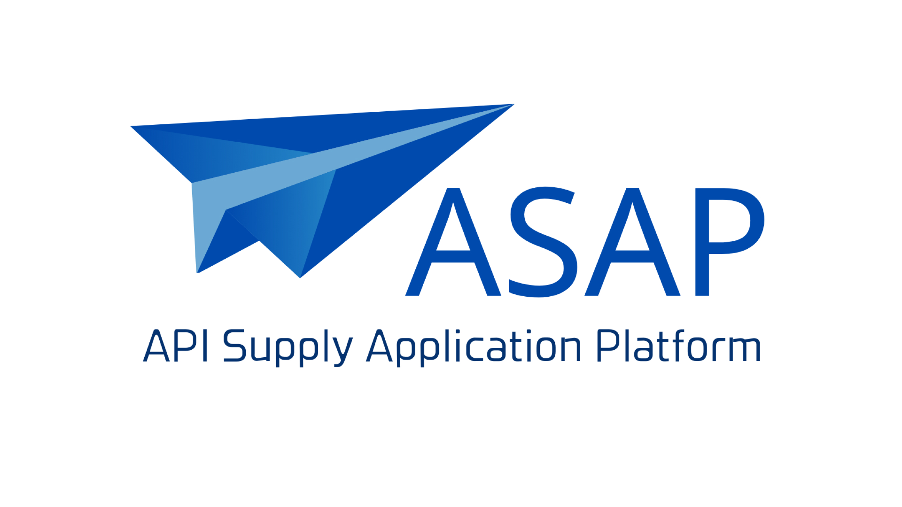
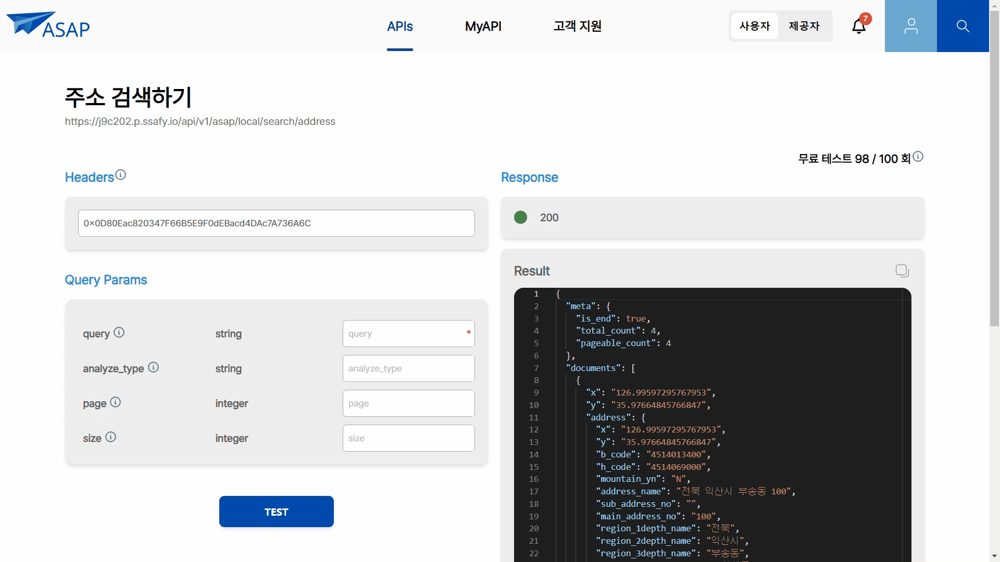
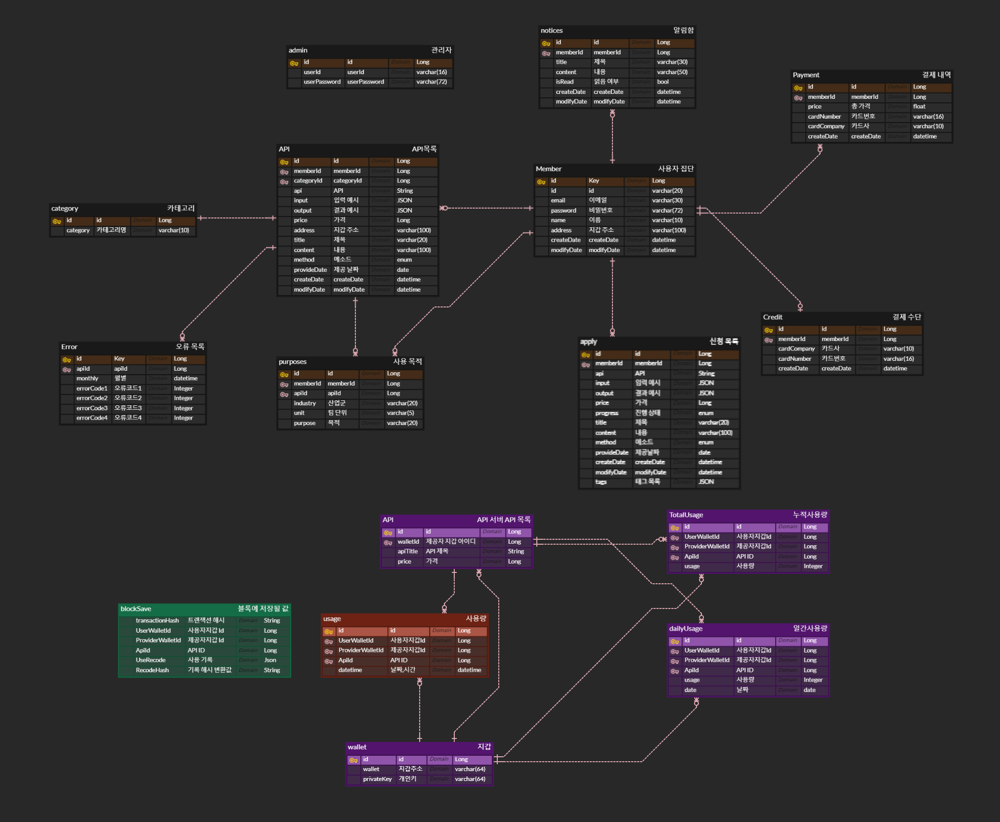

# 🖥️ [ASAP (API Supply Application Platform)](https://j9c202.p.ssafy.io/) 🖥️

### 블록체인을 활용한 API 통합·중개 서비스

##### SSAFY 특화프로젝트 - 블록체인 P2P

##### 프로젝트 기간 : 📅 2023.08.21 ~ 2023.10.06

 
 

## 🗂️ 목차

### 1. [프로젝트 기획 배경](#-프로젝트-기획-배경)

### 2. [기대효과](#-기대효과)

### 3. [주요 기능 소개](#-주요-기능-소개)

### 4. [서비스 제공 화면](#-서비스-제공-화면)

### 5. [산출물](#-산출물)

### 6. [팀원 소개](#-팀원소개)

### 7. [기술 스택](#-기술스택)

 
 

## 📃 프로젝트 기획 배경

 

<h3>1. 급격하게 성장하는 데이터산업</h3>

- 데이터를 사용하는 사업의 규모 증가

- 데이터를 관리하는 서버의 부하 관리 필요성 증대

- 모니터링과 트래픽 분산 필요

 

<h3>2. API 사용에 따른 개발 시간 단축의 필요</h3>

- 적절한 API를 찾기 위해 많은 노력과 시간 소비

- 제공 사이트마다 다른 개인키와 결제 수단

- 통합 서비스 필요

 

<h3>3. 공정성·투명성 가치 중요성 대두</h3>

- 사용 로그 조작, 데이터 베이스 손실에 대한 문제

- 블록체인의 투명성과, 보안성을 통해 공정성과 투명성 강조

 
 

## 👐 기대효과

 

### 1. 사용자

- 다양한 API를 하나의 플랫폼에서 통합적으로 이용 가능

- API를 찾고 연동하는 시간을 절약하여 개발시간 단축 가능

- 투명한 결제 프로세스를 통하여 비즈니스 효율성 증가 및 관리 비용 감소

 

### 2. 제공자

- 사용자 친화적 접근성으로 새로운 고객 및 시장 진입 가능

- 제공되는 API 사용 데이터 통계를 통해 서비스 가용성 및 성능 모니터링

- 블록체인 기술을 통한 공정한 사용 요금 산정으로 사용자와의 신뢰성

 

## ✨ 주요 기능 소개

 

### 1. 사용자

- #### API LIST 제공

  - 서비스에서 제공중인 API 목록 제공

  - 검색 및 카테고리 별 목록 제공으로 사용자가 자신에게 필요한 API를 쉽게 찾아서 사용할 수 있도록 함

   

- #### API 사용 신청

  - 사용자가 자신에게 필요한 API를 별도의 키 발급 없이 편리하게 사용 신청할 수 있도록 함

  - 사용 신청 전에 자신이 원하는 API가 맞는지 확인해 볼 수 있도록 1일 100회의 무료 테스트 제공

  - 신청 후 별도의 승인 과정 없이 바로 API 사용 가능

   

- #### 사용중인 API에 대한 통계 제공

  - 자신이 최근 사용한 모든 API 사용량 및 이용 요금 통계 제공

  - 자신이 사용한 API 별 최근 30일 사용량 및 사용 금액 통계 제공

  - 자신이 사용중인 모든 API 조회

   

- #### API 사용량 검증

  - 사용자는 자신이 사용한 API 사용량을 해쉬값으로 바꾸어 블록체인에 저장된 값과 비교 가능

  - 블록체인 값과 일치함을 확인하여 사용량 및 요금에 대한 신뢰성을 제공

 
 

### 2. 제공자

- #### API 제공 신청

  - API 제공자는 ASAP 서비스에 API를 등록함으로써 편리하게 API를 사용하고자 하는 사용자들의 접근성을 통한 수익 증대

 

- #### 제공중인 API에 대한 통계 제공

  - 자신이 제공한 모든 API 제공량 및 제공 요금(수익) 통계 제공

  - 자신이 제공한 API 별 신규 사용자, 산업군 비율, 동일 카테고리 API 제공량 비교, 최근 30일 제공량 및 수익 통계 제공

  - 제공자가 사업 확대에 이용할 수 있도록 다양한 통계 데이터 제공

  - 자신이 제공중인 모든 API 조회

 
 

### 3. 관리자

- #### 제공 신청된 API 상태 변경

  - 제공자가 제공 신청한 API들의 상세 내용 확인 및 상태 값 변경 가능

 
 

## <a id="service">💻 서비스 제공 화면</a>

### 다양한 API 조회

 
 

### 손쉬운 API 사용법 조회

</img>

 
 

### 사용 신청 전 테스트 제공

</img>

 
 

### 사용·제공량 시각화 자료로 제공

</img>

 
 

### 블록체인으로 사용량 검증 서비스 제공

</img>

 
 

### 간편한 API 신청 서비스 제공

</img>

 

## 📚 산출물

 

### 서비스 아키텍처

 

</img>

 

### ERD

 

</img>

 
 

## 👪 팀원소개

 

|           양시온            |           문지은           |           박서희           |         송아람         |       이도하       |       이찬웅       |
| :-------------------------: | :------------------------: | :------------------------: | :--------------------: | :----------------: | :----------------: |
| 팀장 프론트엔드 CI/CD | 프론트엔드 UI/UX 디자인 | 프론트엔드 UI/UX 디자인 | 프론트엔드 블록체인 | 백엔드 영상편집 | 백엔드 블록체인 |

 
 

## 🛠️ 기술스택

 

### Front

### Back

### BlockChain

### Devops

### 협업 툴

