# **포팅 메뉴얼**

## 목차

1. [Docker](#Docker)

2. [Jenkins](#Jenkins)

3. [Nginx](#Nginx)

4. [MySQL](#MySQL)

5. [Redis](#Redis)

6. [MongoDB](#MongoDB)

7. [Back-end](#Back-end)

8. [Front-end](#Front-end)

9. [Block-Chain](#Block-Chain)

---

# Docker

### Docker 설치 전 필요한 패키지 설치

```bash
sudo apt-get -y install apt-transport-https ca-certificates curl gnupg-agent software-properties-common
```

- apt-transport-https: 패키지 관리자가 https를 통해 데이터 및 패키지에 접근할 수 있도록 한다
- ca-certificates: certificate authority에서 발행되는 디지털 서명. SSL 인증서의 PEM 파일이 포함되어 있어 SSL 기반 앱이 SSL 연결이 되어있는지 확인할 수 있다
- curl: 특정 웹 사이트에서 데이터를 다운로드 받을 때 사용하는 패키
- gnupg-agent: OpenPGP 표준 규격의 데이터 통신을 암호화하고 서명할 수 있는 패키지
- software-properties-common: PPA를 추가하거나 제거할 때 사용한다.
  - PPA: Personal Package Archive(개인 패키지 저장소)를 의미하며, 캐노니컬社의 우분투에서 기본적으로 제공하는 패키지 외의 사적으로 만든 패키지를 의미한다

### Docker에 대한 GPC Key 인증 진행

- OK가 떴다면 정상적으로 등록이 되었다는 뜻이다

```bash
curl -fsSL <https://download.docker.com/linux/ubuntu/gpg> | sudo apt-key add -
```

### Docker 레포지토리 등록

- AMD64 계열
  
  ```bash
  sudo add-apt-repository "deb [arch=amd64] <https://download.docker.com/linux/ubuntu> $(lsb_release -cs) stable"
  ```

- ARM64 계열
  
  ```bash
  sudo add-apt-repository "deb [arch=arm64] <https://download.docker.com/linux/ubuntu> $(lsb_release -cs) stable"
  ```

### 패키지 리스트 갱신

```bash
sudo apt-get -y update
```

### Docker 패키지 설치

- apt-get을 이용하여 Docker를 설치한다
  - docker-ce: Docker Community Edition의 약
  - docker-ce-cli: Docker Community Edition의 CLI 환경에서 추가로 설치해야 하는 패키지
  - [containerd.io](http://containerd.io): Docker 컨테이너 런타임

### Docker 일반 유저에게 권한 부여

- Docker는 항상 root로 실행되기 때문에 sudo를 사용하여 명령어를 입력해야 한다
- 사용자를 docker 그룹에 추가하여 sudo를 사용하지 않아도 docker 명령어를 사용할 수 있도록 한다

```bash
sudo usermod -aG docker ubuntu
```

- Docker 서비스 재시작
  - 이후, 사용자 세션 로그아웃 및 재로그인 필요

### Docker에서 실행되고 있는 컨테이너 목록 조회

```bash
docker ps -a
```

### Docker에서 실행되고 있는 컨테이너 로그 조회

- 단, docker logs로 조회되는 시간은 UTC-0이며, 변경불가
  - 필요시 별도의 logs 확인
  - 참고 : https://github.com/docker/cli/issues/604

```bash
docker logs 컨테이너명
```

### Docker Compose 다운로드

- curl 명령을 이용하여 docker-compose 패키지를 /usr/local/bin/docker-compose 디렉토리에 다운로드 한다

```bash
sudo curl -L "<https://github.com/docker/compose/releases/download/v2.21.0/docker-compose-$>(uname -s)-$(uname -m)" -o /usr/local/bin/docker-compose
```


### /usr/local/bin/docker-compose 권한 변경

- chmod를 이용하여 /usr/local/bin/docker-compose 디렉토리에 대해 모든 사용자에게 실행 권한을 추가시킨다

---

# Jenkins

### 용어

- CI(Continuous Integration): 빌드/테스트 자동화 프로세스
- CD(Continuous Delivery): 배포 자동화 프로세스

## Jenkins 설치 (Docker)

### Jenkins 이미지 받기

- docker의 pull 명령을 통해 최신 LTS 버전의 jenkins 이미지를 다운로드 한다
- Java 8, 11

```bash
docker pull jenkins/jenkins:lts
```

- Java 17

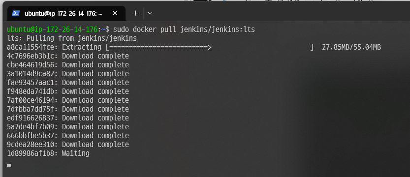

### Jenkins 컨테이너 실행

- Jenkins 컨테이너를 명령어를 통해 서비스를 띄운다
  - sudo : 관리자 권한으로 명령어를 실행한다
  - -d : 컨테이너를 **데몬**으로 띄운다
  - -e TZ=Asia/Seoul : 환경변수 설정 (컨테이너 내부 시간대를 Asia/Seoul로 지정)
  - -p 8080:8080 : 컨테이너 외부와 내부 포트에 대해 **포워딩** 한다
    - 왼쪽 : Host Port
    - 오른쪽 : Container Port
  - -v /etc/localtime:/etc/localtime:ro : Host OS의 localtime을 컨테이너의 localtime과 동기화
  - -v /jenkins:/var/jenkins_home : 도커 컨테이너의 데이터는 컨테이너가 종료되면 사라지기 때문에, **볼륨 마운트** 옵션을 이용하여 Jenkins 컨테이너의 /var/jenkins_home 디렉토리를 Host OS의 /jenkins와 연결하여 데이터를 유지한다
  - --name jenkins : 도커 컨테이너의 이름을 설정하는 옵션
  - -u root : 컨테이너가 실행될 리눅스 사용자 계정 지정 (root)
- Java 8, 11

```bash
docker run -d --env JENKINS_OPTS=--httpPort=8080 -v /etc/localtime:/etc/localtime:ro -e TZ=Asia/Seoul -p 8080:8080 -v /jenkins:/var/jenkins_home -v /var/run/docker.sock:/var/run/docker.sock -v /usr/local/bin/docker-compose:/usr/local/bin/docker-compose --name jenkins -u root jenkins/jenkins:lts
```

- Java 17

```bash
docker run -d --env JENKINS_OPTS=--httpPort=8080 -v /etc/localtime:/etc/localtime:ro -e TZ=Asia/Seoul -p 8080:8080 -v /jenkins:/var/jenkins_home -v /var/run/docker.sock:/var/run/docker.sock -v /usr/local/bin/docker-compose:/usr/local/bin/docker-compose --name jenkins -u root jenkins/jenkins:jdk17
```

- Jenkins 종료

- 정상적으로 컨테이너가 실행되었는지 확인하기 위해, netstat 명령어를 활용하여 포트가 개방되어 있는지 확인한다
  - 아래의 사진에서는 0.0.0.0:8080을 통해, Jenkins 컨테이너가 외부 아이피에 대해 8080 포트가 개방되어 있는 것을 확인할 수 있다

### Jenkins 접속

- 포워딩 및 방화벽 개방 작업까지 완료되었다면, 서버 IP 및 포트번호를 웹 브라우저에 입력하고 접속한다.
  - 웹 페이지에서는 비밀번호를 확인하기 위해 /var/jenkins_home/secrets/initialAdminPassword 경로에 있다고 하는데, 이 경로는 Jenkins가 설치되어 있는 컨테이너 안의 파일이기 때문에 아래와 같은 방법을 이용해야 한다
    
    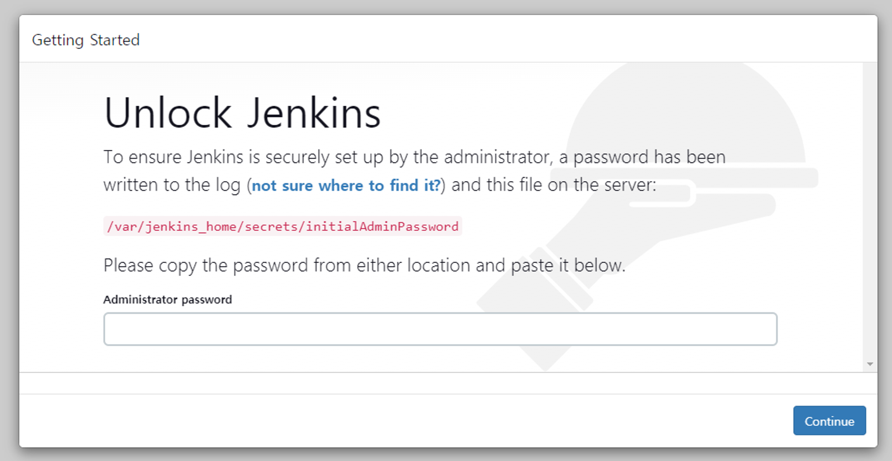

- jenkins 컨테이너 안으로 접속하기 위해 다음 명령어를 활용하여 컨테이너의 bash 쉘에 접속한다

```bash
docker exec -it jenkins /bin/bash
```

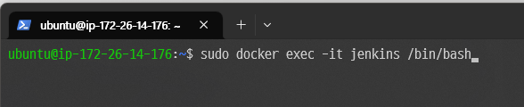

- 해당하는 디렉토리로 이동한다

```bash
cd /var/jenkins_home/secrets
```

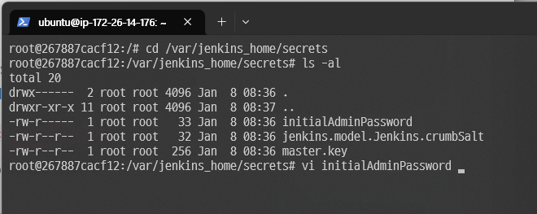

- cat 명령어를 이용하여 초기 비밀번호를 확인한다. 이후, exit을 하여 컨테이너의 bash 쉘에서 나가 Host OS의 쉘로 복귀한다

```bash
cat initialAdminPassword
```

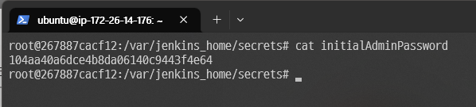

- 조금 전 확인한 방법으로 얻어낸 관리자 비밀번호를 입력한다

## Jenkins 기본 설정

### 기본 플러그인 설치

- 초기 페이지에 접속하면, 우선 추천하는 플러그인을 설치한다 **(Install suggested plugins)**

### 관리자 계정 설정

- 이후 관리자 계정을 설정한다.

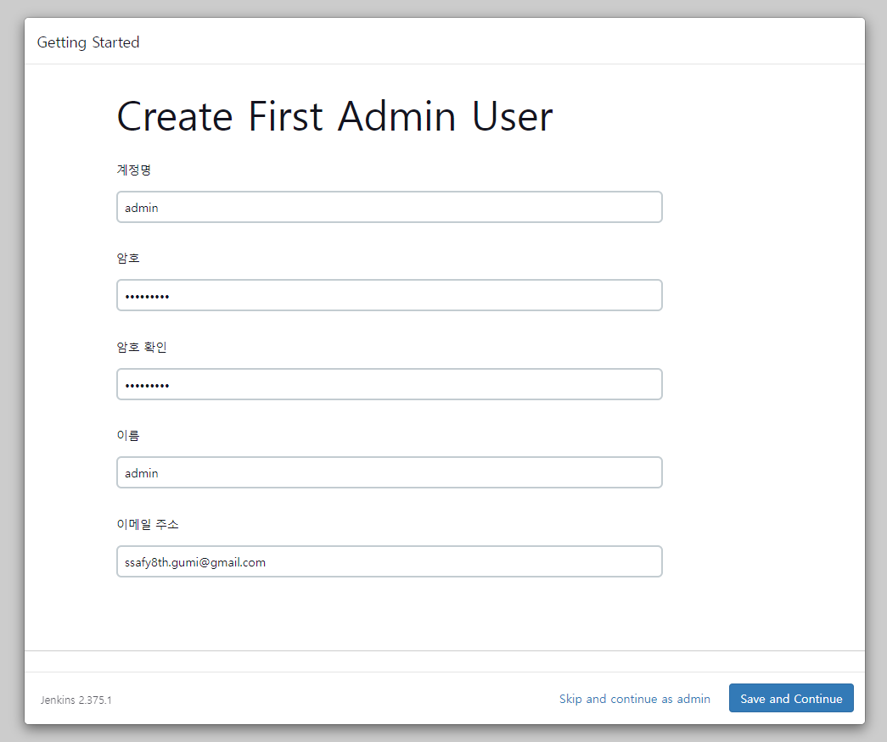

- 서버 인스턴스 설정을 확인하고 Save and Finish 클릭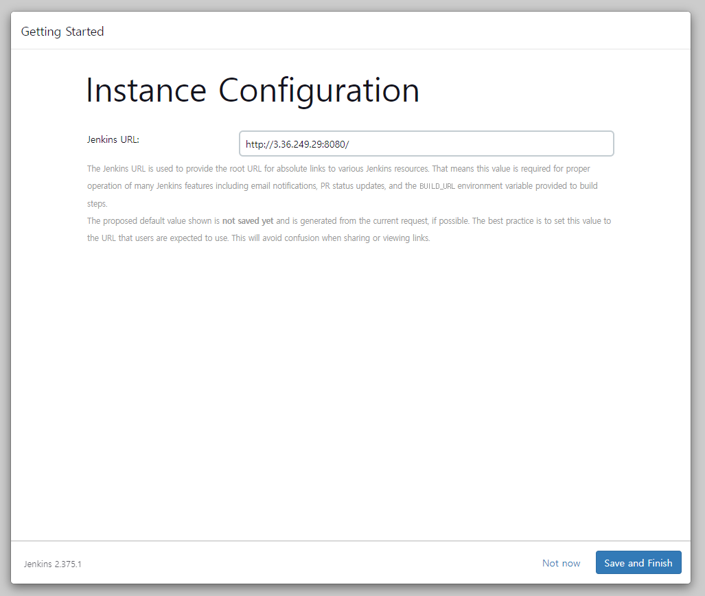

## Jenkins 내부에 Docker 패키지 설치 (컨테이너 재시작시마다 하는 작업)

##### Jenkins 컨테이너 접속

```bash
docker exec -it jenkins /bin/bash
```

### Docker Repository 등록 및 docker-ce 패키지 설치

##### Jenkins 컨테이너 접속

```bash
docker exec -it jenkins /bin/bash
```

### Docker Repository 등록 및 docker-ce 패키지 설치

- AMD64 환경

```bash
apt-get update && apt-get -y install apt-transport-https ca-certificates curl gnupg2 software-properties-common && curl -fsSL <https://download.docker.com/linux/$>(. /etc/os-release; echo "$ID")/gpg > /tmp/dkey; apt-key add /tmp/dkey && add-apt-repository "deb [arch=amd64] <https://download.docker.com/linux/$>(. /etc/os-release; echo "$ID") $(lsb_release -cs) stable" && apt-get update && apt-get -y install docker-ce
```

- ARM64 환경

### Docker Jenkins에서 Host Docker 접근권한 부여

```bash
groupadd -f docker
```

```bash
usermod -aG docker jenkins
```

```bash
chown root:docker /var/run/docker.sock
```

### Docker Compose 다운로드

- curl 명령을 이용하여 docker-compose 패키지를 /usr/local/bin/docker-compose 디렉토리에 다운로드 한다

```bash
curl -L "<https://github.com/docker/compose/releases/download/1.29.2/docker-compose-$>(uname -s)-$(uname -m)" -o /usr/local/bin/docker-compose
```

### /usr/local/bin/docker-compose 권한 변경

- chmod를 이용하여 /usr/local/bin/docker-compose 디렉토리에 대해 jenkins 사용자에게 실행 권한을 추가시킨다

```bash
chmod +x /usr/local/bin/docker-compose
```

### Gitlab Webhook 지정

- Gitlab에 특정 브랜치에 merge request가 된 경우 Webhook을 통해 빌드 및 서비스 재배포 이벤트 발동
- Gitlab의 배포할 서비스의 Repository 접속
- Settings - Webhooks 클릭
  - URL : Jenkins의 Item URL 입력 (양식 : `http://[Jenkins Host]:[Jenkins Port]/project/[파이프라인 아이템명]`)
  - Secret token : Jenkins의 Gitlab trigger 고급 설정 중 Secret token Generate 버튼을 이용해 만든 토큰 입력
  - Trigger : Push events 체크, merge request가 되면 Jenkins 이벤트가 발동하게 할 브랜치 입력

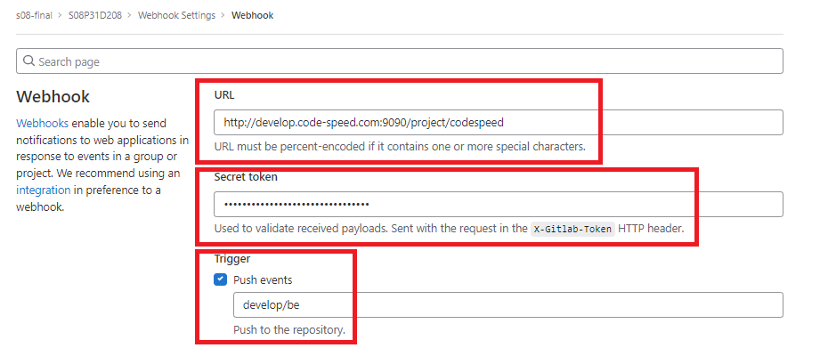

---

# NginX

### NginX 설치 (Host OS)

```bash
sudo apt-get -y install nginx
```

### Nginx 삭제

- 혹시라도 nginx를 삭제 후 재설치할 일이 생기면 다음 명령어를 이용한다
  - `sudo apt-get -y remove --purge nginx`는 `/etc/nginx` 디렉토리에 찌꺼기를 남기기 때문이다

```bash
sudo apt-get -y remove --purge nginx nginx-full nginx-common(https://doitnow-man.tistory.com/entry/nginx-ubuntu-2004%EC%97%90%EC%84%9C-nginx-%EC%99%84%EB%B2%BD%ED%95%9C-%EC%82%AD%EC%A0%9C)
```

## SSL 설정 (CertBot)

### CertBot 다운로드

- snap을 이용해서 다운로드 한다
- `sudo apt-get -y install certbot` 명령어를 이용하면 다음과 같은 오류가 발생하기 때문이다
  - **The requested nginx plugin does not appear to be installed**

```bash
sudo snap install --classic certbot
```

### SSL 인증서 발급

- nginx 사용시
  - -d : 등록할 도메인 Host 주소를 입력한다

```bash
sudo certbot --nginx -d develop.code-speed.com
```

- apache 사용시

```bash
sudo certbot --apache -d develop.code-speed.com
```

- 이메일 주소를 입력한다
  
  - c를 입력하고 Enter를 누르면 취소가 되며, 이메일을 입력하지 않으면 다음으로 진행되지 않는다
  
  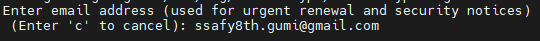

- 이메일로 재단 정보나 홍보성 수신물을 이메일로 받을 것인지 물어본다
  
  - n을 입력하고 Enter를 누른다

- 인증서가 발급되면 다음과 같은 곳에 `fullchain.pem`과 `privkey.pem`이 발급된다
  - 인증서는 발급하려는 도메인마다 디렉토리 위치가 다르니 주의
  - 인증서는 90일마다 갱신해야 하지만, `/etc/cron.d`에 자동으로 갱신되는 스크립트가 설치중 기록된다
  - 갱신되는지 테스트를 하고 싶다면 다음 명령어를 입력한다
    - `sudo certbot renew --dry-run`

### default 설정 편집

```bash
sudo vim /etc/nginx/sites-enabled/default
```

- 다음과 같이 추가
  - 단, `try_files $uri $uri/ =404;`는 주석처리

```bash
include /etc/nginx/conf.d/service-url.inc;
```

```bash
proxy_pass $service_url;
```

### service-url.inc 추가

- vim 편집기

```bash
sudo vim /etc/nginx/conf.d/service-url.inc
```

- 해당내용 추가 후 저장
  - nginx가 자동으로 80포트를 8081 포트로 전환
  - 반드시 맨 끝의 세미콜론(;)을 주의 (붙여야 함)
  - 외부 서버의 서비스를 리버스 프록시하는 경우는 상관없고, 내부 서버의 서비스를 리버시 프록시 하는 경우 `localhost`가 아닌, `127.0.0.1`을 사용할 것
    - 그렇지 않으면 resolve 오류가 발생한다
    - 오류가 발생한 경우 `tail -200f /var/log/nginx/error.log`를 통해 원인을 확인한다

```bash
set $service_url <http://127.0.0.1:8081>;
```

---

# MySQL

- 도커 컨테이너 재시작시 재실행되는것을 막기위해 서버에 직접 설치

### EC2에 MySQL 설치

##### 우분투 서버 업데이트

```powershell
$ sudo apt-get update
```

##### MySQL-server 설치

```powershell
$ sudo apt-get install mysql-server
```

### MySQL 기본 설정

##### 외부 접속 기능 설정 (포트 3306 오픈)

```powershell
$ sudo ufw allow 3306
```

##### MySQL 실행

```powershell
$ sudo systemctl start mysql
```

##### Ubuntu 서버 재시작시 MySQL 자동 재시작

```powershell
$ sudo systemctl enable mysql
```

### My

##### MySQL 접속

```powershell
$ sudo /usr/bin/mysql -u root -p
```

##### MySQL 비밀번호 변경 방법

```sql
mysql> ALTER USER 'root'@'localhost' IDENTIFIED WITH mysql_native_password BY '바꿀비번';
```

#### 데이터 베이스 만들고 확인

```sql
mysql> CREATE DATABASE asap;
mysql> SHOW DATABASES;
```

#### 데이터베이스를 사용할 계정 `c208` 만들고 확인

```sql
mysql> CREATE USER 'c202'@'%' IDENTIFIED BY 'mysql비번';
mysql> FLUSH PRIVILEGES;
mysql> SELECT User, Host, authentication_string FROM mysql.user;
```

#### 데이터베이스를 사용할 계정 `testuser` 에 권한 부여

```sql
mysql> GRANT ALL PRIVILEGES ON asap.* TO'c202'@'%';
mysql> FLUSH PRIVILEGES;
mysql> SHOW GRANTS FOR'c202'@'%';
mysql> SELECT User, Host, authentication_string FROM mysql.user;
```

---

# Redis

### EC2에 Redis 설치

##### 업데이트

```powershell
sudo apt-get update
```

##### 설치

```powershell
sudo wget http://download.redis.io/redis-stable.tar.gz
sudo tar xvzf redis-stable.tar.gz
cd redis-stable
make
```

### Redis 설정 편집

##### 저장된 경로의 redis.conf 파일을 vim으로 열고 편집

```powershell
sudo vim /home/ubuntu/redis-stable/redis.conf
```

##### redis.conf

```
maxmemory 500m # 최대메모리 설정
maxmemory-policy noeviction allkeys-lru # 초과시 가장 안 쓰인 거 부터 제거하는 정책.
bind 0.0.0.0 ::1 # 모든 IP 접근허용처리
requirepass {비밀번호 지정}
port 6378 # 포트 설정
# 기본 6379는 openvidu에서 사용하기때문에 6378포트 사용
stop-writes-on-bgsave-error no # 메모리 초과시 서버 정지하게 하지 않는다는 설정
```

##### 설정 변경 후 Redis 서버 재시작

```powershell
sudo service redis restart
```

##### ※ sevice 파일이 없을때

```
nano /etc/systemd/system/redis.service


# redis.service 파일
[Unit]
Description=Redis In-Memory Data Store
After=network.target

[Service]
User=ubuntu
Group=ubuntu
# redis-server위치 - redis.conf 위치
ExecStart=/usr/local/bin/redis-server /home/ubuntu/redis-stable/redis.conf
ExecStop=/usr/local/bin/redis-cli shutdown
Restart=always

[Install]
WantedBy=multi-user.target
```

##### ※ make 시에 오류가 뜨거나 안된다면

```powershell
udo yum install tcl
make distclean
make
```

##### 서버 실행

```powershell
cd src

./redis-server

redis-cli
```

---

# MongoDB

- 빠른 설치를 위해 도커 컨테이너로 실행

##### 이미지 받기

```powershell
docker pull mongo
```

##### 컨테이너 실행

```powershell
docker run -d --name mongodb -v /xxx/xxx/xxx/docker/mongo:/data/db   \
-e MONGO_INITDB_ROOT_USERNAME=root   \
-e MONGO_INITDB_ROOT_PASSWORD=1234   \
-p 27017:27017 mongo
```

##### 컨테이너 접속

```powershell
docker exec -it mongodb /bin/bash
```

##### Mongo DB 접속

```powershell
mongo -u root -p 1234
mongosh -u root -p 1234
```

- 버전에 따라 mongosh 명령어로 접속해야 정상 작동

##### MongoDB 계정 생성

```powershell
use admin;
db.createUser(
  {
    user: "asap",
    pwd:  "!asap123!@#",
    roles: [
        { "role" : "root", "db" : "admin" },
    ]
  }
)
```

##### 데이터 베이스 생성

```powershell
use asap;
```

---

# Back-end

##### DockerFile 작성

```dockerfile
# jdk 이미지 불러오기
FROM openjdk:17-jdk-slim

# Docker Container에서 작업이 이루어지는 위치
WORKDIR /root

ARG JAR_FILE=build/libs/*.jar

# 현재 경로/target/be-0.0.1-SNAPSHOT.jar에 해당하는 파일을 Docker Container의 WORKDIR 위치로 복사 (이미지 생성할 때 동작)
COPY ${JAR_FILE} app.jar

# COPY된 jar파일 실행하기 (컨테이너 실행할 때 동작)
CMD ["java", "-jar", "./app.jar"]
```

##### Build 과정

```
npm run build
docker build -t {docker-hub 계정}/{docker-hub 레포지토리}:{태그} .
docker push {docker-hub 계정}/{docker-hub 레포지토리}:{태그}
```

##### push 후에 ubuntu 환경에서 pull 받기

```
sudo docker pull {docker-hub 계정}/{docker-hub 레포지토리}:{태그}

sudo docker run -d -p {포트}:{포트} --name {컨테이너명} {back 이미지명 혹은 태그} 
```

---

# Front-end

##### Dockerfile 작성

```
# 가져올 이미지를 정의
FROM node:18
# 경로 설정하기
WORKDIR /app
# package.json 워킹 디렉토리에 복사 (.은 설정한 워킹 디렉토리를 뜻함)
COPY package.json .
# 명령어 실행 (의존성 설치)
RUN npm install
# 현재 디렉토리의 모든 파일을 도커 컨테이너의 워킹 디렉토리에 복사한다.
COPY . .

# 각각의 명령어들은 한줄 한줄씩 캐싱되어 실행된다.
# package.json의 내용은 자주 바뀌진 않을 거지만
# 소스 코드는 자주 바뀌는데
# npm install과 COPY . . 를 동시에 수행하면
# 소스 코드가 조금 달라질때도 항상 npm install을 수행해서 리소스가 낭비된다.

# 3000번 포트 노출
EXPOSE 3000

# npm start 스크립트 실행
CMD ["npm", "start"] 
```

#### Build 과정

```
npm run build
docker build -t {docker-hub 계정}/{docker-hub 레포지토리}:{태그} .
docker push {docker-hub 계정}/{docker-hub 레포지토리}:{태그}
```

##### push 후에 ubuntu 환경에서 pull 받기

```
sudo docker pull {docker-hub 계정}/{docker-hub 레포지토리}:{태그}

sudo docker run -d -p {포트}:{포트} --name {컨테이너명} {front 이미지명 혹은 태그}
```

```
# 이미지 확인
sudo docker images

# 컨테이너 확인
sudo docker ps
```

--- 

# Block-Chain

##### Geth 설치

1. https://geth.ethereum.org/downloads 에서 1.11.X 버전 다운로드
   
   

2. 링크 주소 복사 후 서버에서 wget으로 설치
   
   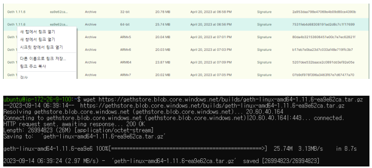

3. 압축 해제 후 geth 실행파일 /usr/local/bin/ 으로 이동 후 버전 확인
   
   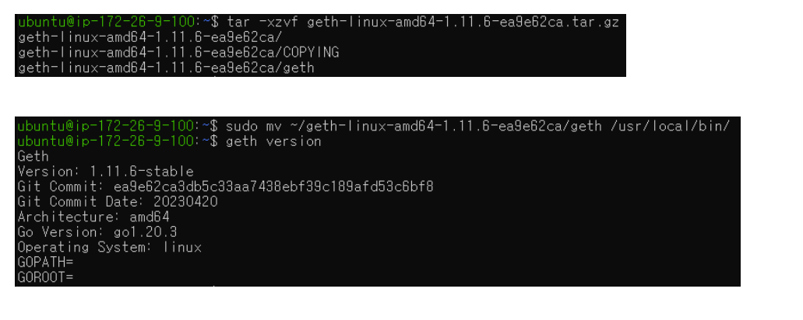

##### Generating Accounts

1. geth account new –datadir [새로 생성하는 계정 디렉토리명] 지정하는 Password와 Public address, Key file 생성 경로 확인
   
   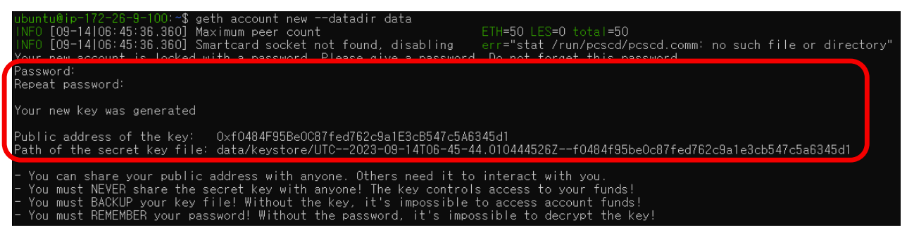

##### genesis.json 확인 및 Geth Database 초기화

- Text Editor로 genesis.json 파일 생성
  
  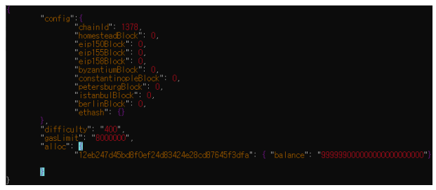
  
  ```json
  {
      "config": {
          "chainId": 1378,
          "homesteadBlock": 0,
          "eip150Block": 0,
          "eip155Block": 0,
          "eip158Block": 0,
          "byzantiumBlock": 0,
          "constantinopleBlock": 0,
          "petersburgBlock": 0,
          "istanbulBlock": 0,
          "berlinBlock": 0,
          "ethash": {}
      },
      "difficulty": "400",
      "gasLimit": "8000000",
      "alloc": {
          "12eb247d45bd8f0ef24d83424e28cd87645f3dfa": { 
              "balance": "999999000000000000000000"
          }
      }
  }
  ```

- geth init –-datadir [새로 생성하는 노드 디렉토리명] genesis.json
  
  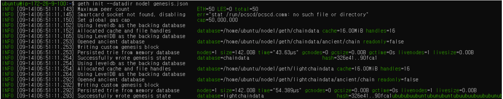

##### 노드로 참여하기

1. 앞서 생성한 [노드 디렉토리명], [서버 Public IP], [Public Address] 입력 
   
       ※ nohup으로 백그라운드 실행(파란색 글씨)
   
   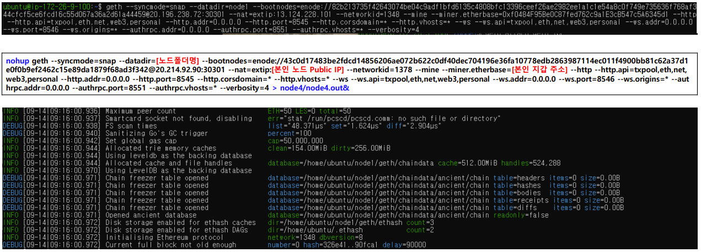

##### 노드 피어 상태 확인

1. (노드로 참여하기)에서 진행한 노드참여항 커맨드 창은 켜둔 상태

2. 새창에서 [노드 디렉터리]로 이동 후 geth.ipc 실행

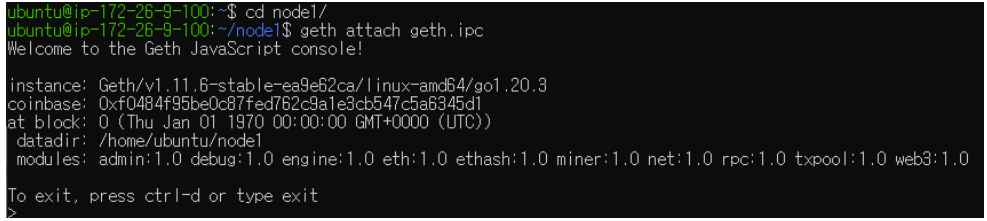

##### Private Key

1. web3.js 설치: curl -LSs https://raw.githubusercontent.com/gochain/web3/master/install.sh | sh

2. 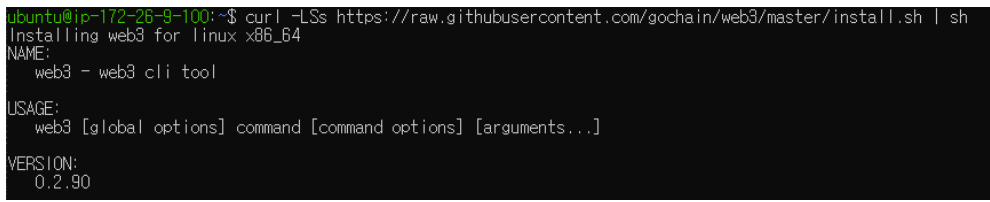
   
   web3 account extract --keyfile [생성한 키파일 위치] –password [생성한 패스워드]
   
   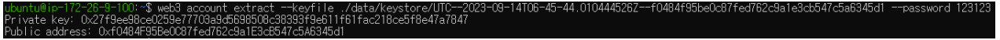